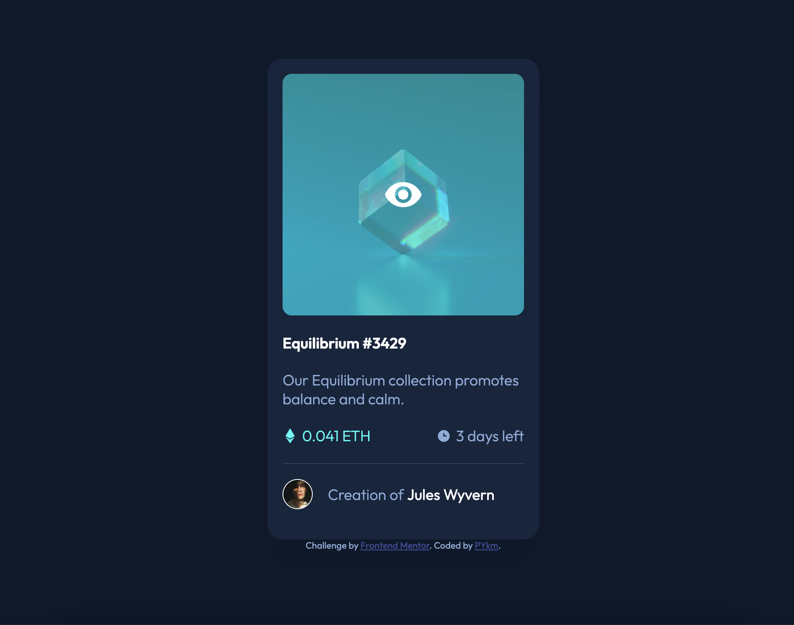
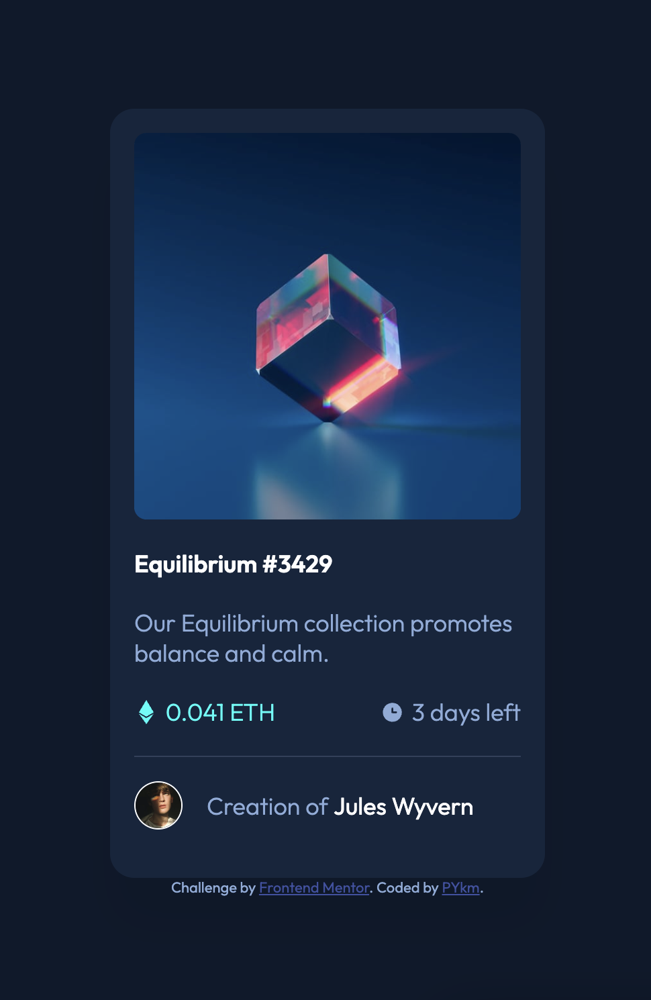

# Frontend Mentor - NFT preview card component solution

This is a solution to the [NFT preview card component challenge on Frontend Mentor](https://www.frontendmentor.io/challenges/nft-preview-card-component-SbdUL_w0U). Frontend Mentor challenges help you improve your coding skills by building realistic projects.

## Table of contents

- [Overview](#overview)
  - [The challenge](#the-challenge)
  - [Screenshot](#screenshot)
  - [Links](#links)
- [My process](#my-process)
  - [Built with](#built-with)
  - [What I learned](#what-i-learned)
  - [Continued development](#continued-development)
  - [Useful resources](#useful-resources)
- [Author](#author)
- [Acknowledgments](#acknowledgments)

## Overview

### The challenge

Users should be able to:

- View the optimal layout depending on their device's screen size
- See hover states for interactive elements

### Screenshot




### Links

- Solution URL: [on Frontend Mentor](https://www.frontendmentor.io/solutions/nft-preview-card-component-I8iBuk3HR3)
- Live Site URL: [on Github](https://pykm.github.io/nft-preview-card-challenge-solution/)

## My process

### Built with

- Semantic HTML5 markup
- CSS custom properties
- Flexbox
- Mobile-first workflow

### What I learned

Set display property to block to remove the white space below the image elements:

```css
.nft-product > * {
  display: block;
}
```

Use CSS to add pseudo elements, in this case, icons, to the additional infos, then use flexible box layout to vertical align the icons;

```html
  <p class="ethereum">0.041 ETH</p>
```
```css
.ethereum{
  display: flex;
  flex-direction: row;
  align-items: center;
  gap: .3em;
}

.ethereum:before{
    content: '';
    background-image: url('../images/icon-ethereum.svg');
    background-position: center;
    background-repeat: no-repeat;
    background-size: 0.61em 1em;
    height: 1.25em;
    width: 1em;
}
```

To Add the overlay to the image element:
1. Set a background color on it's parent element,
1. Change opacity on it so that the background will be shown when in hovered state;
1. Add the view icon using image element, but set alt="" so that non-visual browsers could omit it from rendering,
1. Using position property to absolute on the view icon image element so that it can cover the product image and not occupying the width and height from the normal flow.
1. Change opacity on the view icon image element so that the icon will be shown when in hovered state.

```html
<div class="nft-product">
  
  
</div>
```
```css
.nft-product{
  position: relative;
  background-color: var(--active-color);
}
.nft-product-overlay{
  object-fit: none;
  object-position: center;
  position: absolute;
  top: 0;
  left: 0;
  width: 100%;
  opacity: 0;
}
.nft-product:hover > .nft-product-image{
  opacity: 0.5;
}
.nft-product:hover > .nft-product-overlay{
  opacity: 1;
  cursor: pointer;
}
```

### Continued development

Technique that I'm not completely comfortable with, can be found in this challenge:
- Add Overlay to an image element

Technique that I found useful, although not using in this challenge:
- SASS

### Useful resources

- [Understand the logic behind why inline elements have descenders](https://mor10.com/removing-white-space-image-elements-inline-elements-descenders/) - This helped me when I noticed there was an annoying padding space below my image.
- [Two ways to use SVG with pseudo element](https://www.geeksforgeeks.org/how-to-use-svg-with-before-or-after-pseudo-element/) - I know the content: url('url/of/the/icon.svg') way, but not the other, so I decided to give it go, it turns out pretty well. Thanks to this article. Besides, it provides other useful property like zoom to control the size of the svg, which I didn't know before.

## Author

- Website - [PYkm](https://pykm.github.io/)
- Frontend Mentor - [@PYkm](https://www.frontendmentor.io/profile/PYkm)

## Acknowledgments

Thanks to people and organizations below, who really inspired and helped me during the challenge.
- **Morten Rand-Hendriksen**. Your article about removing white space below image elements really helped me know not only what to do, and why. Really amazing article, thak you.
- **vcarames**. I checked your [solution](https://vcarames.github.io/NFT-Card/) while having trouble adding the image overlay.
